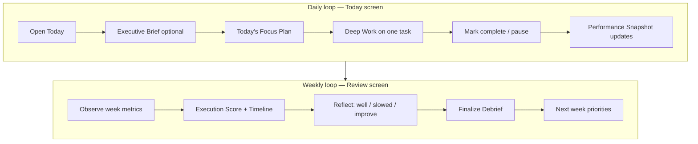

# Ciara OS — System & Screen Reference

**Version:** 1.0.0  
**Flutter app:** local-first execution system (SQLite on device)  
**Optional backend:** `ciara_os_backend/` — FastAPI + Groq for the Executive Brief  
**Stack:** Flutter · Riverpod · GoRouter · Drift (SQLite) · SharedPreferences · `http` (AI client)  
**Design source:** Stitch mockups (`stitch_ciara_os_execution_system/`)

---

## Table of contents

### Product (non-technical)
1. [What Ciara OS is](#what-ciara-os-is)
2. [Who it is for](#who-it-is-for)
3. [Core concepts](#core-concepts)
4. [Daily & weekly loops](#daily--weekly-loops)
5. [Screen map at a glance](#screen-map-at-a-glance)

### Technical
6. [Architecture](#architecture)
7. [Repositories & project layout](#repositories--project-layout)
8. [Navigation & routing](#navigation--routing)
9. [Data model](#data-model)
10. [Time, tasks & metrics](#time-tasks--metrics)
11. [AI layer (Executive Brief)](#ai-layer-executive-brief)
12. [Shared UI & theming](#shared-ui--theming)
13. [Primary screens](#primary-screens)
14. [Secondary screens](#secondary-screens)
15. [Enums & domains](#enums--domains)
16. [Running & development](#running--development)
17. [Stubs & future work](#stubs--future-work)
18. [File index](#file-index)

---

## What Ciara OS is

Ciara OS is a **personal execution system** — not a generic to-do list. It is built around how a techie actually works when juggling:

- Deep technical work (engineering, security, CTF practice)
- Active projects with next actions
- A job/program application pipeline
- Weekly reflection and course correction

The app answers three questions every day:

1. **What should I execute right now?** → Today queue + Deep Work Engine  
2. **What is the strategic picture?** → Projects, Pipeline, Executive Brief (AI)  
3. **Am I improving over time?** → Performance Snapshot, Executive Debrief (Review)

**Privacy model:** All task, project, opportunity, focus-session, and review data lives **on your device** in SQLite. Nothing is uploaded unless you explicitly run the optional local AI backend and tap **Generate Today's Mission** — and even then, only a structured summary of your execution context is sent to Groq via your machine.

---

## Who it is for

Designed for a single operator (you) building a career in **software engineering and cybersecurity** while:

- Applying to jobs, internships, fellowships, and programs  
- Shipping portfolio projects  
- Practicing security skills  
- Needing honest daily prioritization without motivational fluff  

The AI Executive Agent is tuned for that profile: it cites real task names, pipeline deadlines, and postpone patterns — not generic productivity advice.

---

## Core concepts

| Concept | Plain language | Technical flag / store |
|---------|----------------|------------------------|
| **Backlog** | Everything you might do | All tasks in SQLite |
| **Today queue** | What you committed to execute today | `tasks.today == true` |
| **Started** | You are actively working this task (focus session) | `tasks.started` + `focus_sessions` |
| **Deep work** | Timed focus on one task toward a 45-min goal | `focus_sessions` rows |
| **Done** | Task is complete | `tasks.status == done` |
| **Project** | Multi-step outcome with a next action | `projects` table |
| **Pipeline lead** | Job/program opportunity with stages & documents | `opportunities` table |
| **Executive Brief** | AI morning mission from live context | Groq via local backend |
| **Executive Debrief** | Weekly score, narrative, reflections | `weekly_reviews` + rule-based generators |

### Today queue vs completion

These are **independent** fields by design, with one automation:

- **`today`** — “show on Today screen”  
- **`status`** — lifecycle (`notStarted` → `inProgress` → `done`)

When you **mark a task complete**, `Task.markedDone()` sets:

- `status: done`  
- `today: false` (removes from Today list)  
- `started: false`  

Completed work still counts in **Performance Snapshot** for the calendar day (see [Performance Snapshot](#performance-snapshot-today)).

---

## Daily & weekly loops



**Daily:** Plan → Execute → Measure (same day).  
**Weekly:** Observe → Measure → Understand → Reflect → Improve → Prepare.

---

## Screen map at a glance

| Area | Route | One-line purpose |
|------|-------|------------------|
| Today | `/` | Execute today's plan |
| Backlog | `/tasks` | Full task inventory |
| Projects | `/projects` | Active workstreams |
| Pipeline | `/opportunities` | Applications & leads |
| Review | `/review` | Weekly Executive Debrief |
| Profile | `/profile` | Identity, stats, tagline |
| Settings | `/settings` | Theme, data, onboarding reset |
| Task / Project / Opportunity detail & forms | `/tasks/*`, `/projects/*`, `/opportunities/*` | CRUD + deep work |

---

## Architecture

```
lib/
├── main.dart                      # App entry, onboarding bootstrap, theme
├── router/app_router.dart         # GoRouter routes + onboarding redirect
├── database/                      # Drift schema (v6), migrations
├── models/                        # Domain types, enums, ExecutiveBrief
├── repositories/                  # CRUD + queries (tasks, projects, …)
├── providers/                     # Riverpod wiring (incl. ai_providers)
├── services/                        # Stats, debrief generators, AI client
├── screens/
│   ├── primary/                   # Bottom-nav destinations
│   └── secondary/                 # Detail, create/edit, profile, settings
├── widgets/                       # Feature UI by area (today/, deep_work/, …)
├── utils/                           # Filters, grouping, review stats
└── theme/                         # Colors, typography, spacing, ThemeData
```

| Layer | Responsibility |
|-------|----------------|
| **Screens** | Route-level layout, orchestration |
| **Widgets** | Feature UI components |
| **Providers** | Reactive state, streams from DB, AI session cache |
| **Repositories** | Data access |
| **Services** | Side effects, generators, HTTP to AI backend |
| **Database** | SQLite via Drift, migrations |

**State management:** `flutter_riverpod`

| Pattern | Used for |
|---------|----------|
| `StreamProvider` | Live lists (`allTasksProvider`, `todayTasksProvider`, …) |
| `FutureProvider` | Single records, debrief build, performance snapshot |
| `NotifierProvider` | Deep Work Engine (`focusSessionProvider`) |
| `StateNotifierProvider` (legacy) | Executive Brief session cache (`executiveBriefProvider`) |
| `StateProvider` | Filters, theme mode |

**Persistence:**

| Store | Contents |
|-------|----------|
| **Drift (SQLite)** | Tasks, projects, opportunities, focus sessions, weekly reviews |
| **SharedPreferences** | Onboarding, daily focus seconds, streak, theme, profile tagline, notification toggle |

---

## Repositories & project layout

Ciara OS spans two repos on disk:

```
~/Documents/
├── ciara_os/              # Flutter app (this repo)
└── ciara_os_backend/      # FastAPI AI backend (sibling, optional)
    ├── main.py
    ├── requirements.txt
    ├── .env.example       # GROQ_API_KEY=…
    └── .env               # gitignored — never commit
```

The Flutter app runs fully offline. The backend is only required for the **Executive Brief** card on Today.

---

## Navigation & routing

### Onboarding gate

Until `onboarding_complete` is set in SharedPreferences, all routes redirect to `/onboarding`. After completion, `/onboarding` redirects to `/`.

### Primary shell (`ShellRoute`)

Five bottom-nav tabs inside `PrimaryShellScaffold` + `PrimaryNavBar`.

On first shell mount, if an interrupted `focus_sessions` row exists (`endedAt IS NULL`), **Session Recovery** offers Resume or Discard.

| Tab | Route | Screen |
|-----|-------|--------|
| Today | `/` | `TodayScreen` |
| Backlog | `/tasks` | `TasksScreen` |
| Projects | `/projects` | `ProjectsScreen` |
| Pipeline | `/opportunities` | `OpportunitiesScreen` |
| Review | `/review` | `ReviewScreen` |

### Secondary routes (full-screen, no bottom nav)

| Route | Screen |
|-------|--------|
| `/onboarding` | `OnboardingScreen` |
| `/profile` | `ProfileScreen` |
| `/settings` | `SettingsScreen` |
| `/tasks/new` | `TaskCreateEditScreen` (create) |
| `/tasks/:id` | `TaskDetailScreen` |
| `/tasks/:id/edit` | `TaskCreateEditScreen` (edit) |
| `/projects/new` | `ProjectCreateEditScreen` (create) |
| `/projects/:id` | `ProjectDetailScreen` |
| `/projects/:id/edit` | `ProjectCreateEditScreen` (edit) |
| `/opportunities/new` | `OpportunityCreateEditScreen` (create) |
| `/opportunities/:id` | `OpportunityDetailScreen` |
| `/opportunities/:id/edit` | `OpportunityCreateEditScreen` (edit) |

**Query parameters:**

- `/tasks/new?projectId=…&title=…` — pre-fill project link and title

**Header chrome:** `TodayHeader` on primary screens — settings icon → `/settings`, avatar → `/profile`.

---

## Data model

**Schema version:** 6

### Tasks

| Field | Type | Notes |
|-------|------|-------|
| `id` | int | Auto-increment PK |
| `title` | text | Required |
| `domain` | text | `Domain` enum name |
| `status` | text | Default `notStarted` |
| `priority` | text | Default `medium` |
| `started` | bool | Synced with active focus session |
| `today` | bool | In today's execution queue |
| `deadline` | DateTime? | Optional due date |
| `projectId` | int? | FK → projects |
| `notes` | text? | Execution notes |
| `postponeCount` | int | Deferral counter |
| `estimatedDurationMinutes` | int? | Planning estimate (default UI: 45m) |
| `totalFocusedSeconds` | int | Sum of completed session durations |
| `focusSessionCount` | int | Completed session count |
| `planningAccuracy` | real? | 0–100, set on task completion |
| `lastFocusSessionAt` | DateTime? | Last completed session |
| `createdAt` / `updatedAt` | DateTime | Audit timestamps |

**Completion helper:** `Task.markedDone()` → `done` + `today: false` + `started: false`.

### Focus sessions (`focus_sessions`)

Each row is one deep work session bound to exactly one task. Only one row may have `endedAt IS NULL` at a time.

| Field | Type | Notes |
|-------|------|-------|
| `id` | int | PK |
| `taskId` | int | FK → tasks |
| `startedAt` | DateTime | Session start |
| `endedAt` | DateTime? | Null while active |
| `durationSeconds` | int | Final duration on complete |
| `focusQuality` | text? | `deepFocus` · `good` · `okay` · `distracted` |
| `goalReached` | bool | Duration ≥ 45 minutes |
| `pausedElapsedSeconds` | int | Checkpointed elapsed time |
| `segmentStartedAt` | DateTime? | Non-null when clock is running |
| `createdAt` / `updatedAt` | DateTime | |

### Projects

| Field | Type | Notes |
|-------|------|-------|
| `id` | int | PK |
| `name` | text | Required |
| `domain` | text | `Domain` enum |
| `status` | text | Default `active` |
| `nextAction` | text? | Immediate next step |
| `externalLink` | text? | `http(s)://` URL |
| `description` | text? | Long-form context |
| `timeAllocationDays` | int | Default 30; milestone horizon |
| `createdAt` / `updatedAt` | DateTime | |

### Opportunities

| Field | Type | Notes |
|-------|------|-------|
| `id` | int | PK |
| `title` | text | Required |
| `organization` | text | Required |
| `location` | text | Required |
| `type` | text | `OpportunityType` |
| `status` | text | Pipeline stage |
| `deadline` | DateTime? | Application due date |
| `fitNotes` | text? | Strategic fit notes |
| `documents` | text? | JSON checklist items |
| `documentsTotal` / `documentsReady` | int | Checklist progress |
| `link` | text? | Application URL or email |
| `leadQuality` | int? | 1–3 rating |
| `createdAt` / `updatedAt` | DateTime | |

### Weekly reviews

| Field | Type | Notes |
|-------|------|-------|
| `id` | int | PK |
| `weekOf` | DateTime | Monday of review week |
| `whatWorked` / `whatFailed` / `improvementForNextWeek` | text? | Reflection fields |
| `nextActions` | text? | JSON next-week priorities |
| `executionScore` | real? | Weighted score at finalize |
| `weeklyNarrative` | text? | Generated paragraph |
| `insightsJson` | text? | Deterministic insights snapshot |
| `locked` | bool | Finalized debrief |
| `createdAt` / `updatedAt` | DateTime | |

### Migrations

| Version | Change |
|---------|--------|
| v2 | `opportunities.leadQuality` |
| v3 | `opportunities.location` |
| v4 | `projects.timeAllocationDays` |
| v5 | `focus_sessions` table; task deep work columns |
| v6 | Weekly review debrief fields |

---

## Time, tasks & metrics

Ciara OS tracks **execution quality**, not just elapsed time.

| Concept | Unit | Persisted? | Where used |
|---------|------|------------|------------|
| Focus session | Seconds | Yes | Deep Work card, task detail, AI context |
| 45-min Deep Work Goal | Seconds | Reference | Progress ring; timer continues past goal |
| `started` flag | Boolean | Yes | Task rows; Deep Work Engine |
| `today` flag | Boolean | Yes | Today queue (cleared on complete) |
| Estimated duration | Minutes | Yes | Session planning, planning accuracy |
| Planning accuracy | 0–100 | Yes | Task detail, Performance Snapshot |
| Focus quality | Enum | Yes | End-session dialog, daily averages |
| Task deadline | Calendar date | Yes | Badges, filters |
| Project time allocation | Days | Yes | Milestone math |
| Focus uptime (daily) | Seconds | SharedPreferences | Performance Snapshot |
| Daily streak | Days | SharedPreferences | Performance Snapshot |
| Weekly started-rate | % | Computed | Review aggregate |

### Deep Work Engine

**Provider:** `focusSessionProvider` (`DeepWorkEngineNotifier`)

**Rules:**

- One globally active session (`endedAt IS NULL`)
- Start → `focus_sessions` row + `task.started = true`
- Pause → checkpoint elapsed, flush daily stats, `task.started = false`
- End → quality rating required; updates task aggregates; clears active state
- Progress toward 45 min is visual only — clock keeps running
- Checkpoint every 15s to SQLite for crash recovery
- App launch → recovery dialog if orphaned session exists

**Planning accuracy** (`computePlanningAccuracy`): on complete, compares estimate vs actual focused time → 0–100 score.

### Performance Snapshot (Today)

**Provider:** `todayPerformanceProvider`  
**UI:** `PerformanceSnapshotCard` in `TodaySidebar`

| Tile | Logic |
|------|-------|
| **Completed** | `completedToday / totalToday` — see below |
| **Deep work** | Persisted daily seconds + unflushed active session |
| **Sessions** | Completed sessions today (+ active if any) |
| **Focus quality** | Mean quality score of today's sessions |
| **Accuracy** | Mean `planningAccuracy` of day's task set |
| **Streak** | Consecutive active days |

**Day task set** (`tasksForPerformanceDay` in `task_filter_utils.dart`):

- **Total:** tasks with `today == true` **OR** completed today (`status == done` and `updatedAt` on today's calendar date)  
- **Completed count:** all tasks completed today (even if removed from today queue)

This keeps `2/3` correct after marking tasks done (they leave the list but still count for the day).

---

## AI layer (Executive Brief)

### Overview

The **Executive Brief** is a morning AI card on the Today screen. It sends a structured snapshot of your execution context to a local FastAPI backend, which calls **Groq** (`llama-3.3-70b-versatile`) and returns a focused mission — not motivational fluff.

**User flow:**

1. Open Today → see **Executive Brief** above **TODAY'S FOCUS PLAN**  
2. Tap **⚡ Generate Today's Mission** (or refresh when loaded)  
3. Card shows greeting, mission, risk, recommendation, priority score, expected outcome  
4. Collapse after reading — stays collapsed on return visits (session cache)  
5. On failure → specific error (connection vs invalid API key vs AI parse error)

### Flutter components

| File | Role |
|------|------|
| `widgets/today/executive_brief_card.dart` | UI: empty / loading / loaded / error / collapsed |
| `services/ai_context_builder.dart` | Builds JSON payload from local providers |
| `services/ai_service.dart` | HTTP client, `AiFetchResult` error mapping |
| `models/executive_brief.dart` | Typed response (`ExecutiveBrief`, mission, risk) |
| `providers/ai_providers.dart` | `aiServiceProvider`, `executiveBriefProvider` |

**Context payload** (`AiContextBuilder.build`):

| Key | Source |
|-----|--------|
| `date` | Today (ISO `yyyy-MM-dd`) |
| `tasks_today` | `todayTasksProvider` |
| `this_week` | `weekTasksProvider(monday)` — started rate, completed/total, focused hours |
| `active_projects` | `allProjectsProvider` (status `active`) + pending linked tasks |
| `opportunities_due_this_week` | Deadlines within 7 days |
| `patterns` | Most postponed task across `allTasksProvider` |

**Backend URL:** `AiServiceConfig.baseUrl` — default `http://localhost:8001`. Override:

```bash
flutter run --dart-define=CIARA_AI_BACKEND_URL=http://localhost:8001
```

**Session cache:** `executiveBriefProvider` holds the brief for the app session; re-fetch on explicit refresh or new generate.

### Python backend (`ciara_os_backend/`)

```
ciara_os_backend/
├── main.py           # FastAPI app
├── requirements.txt  # fastapi, uvicorn, groq, python-dotenv, pydantic
├── .env.example
├── .env              # GROQ_API_KEY — gitignored
└── README.md
```

| Method | Path | Description |
|--------|------|-------------|
| GET | `/health` | `{"status": "ok"}` |
| POST | `/api/brief` | Executive Brief from JSON context |

**Environment:** `GROQ_API_KEY` in `.env`. Restart uvicorn after changing `.env` (reload does not refresh env).

**Run:**

```bash
cd ciara_os_backend
source venv/bin/activate
uvicorn main:app --reload --port 8001
```

**Response shape (Groq JSON):**

```json
{
  "greeting": "string",
  "mission": { "title", "reason", "estimated_minutes" },
  "risk": { "present": bool, "description": "string|null" },
  "recommendation": "string",
  "priority_score": 0-100,
  "expected_outcome": "string"
}
```

**Errors:** 502 if Groq fails or JSON invalid; Flutter maps these to user-visible messages (invalid API key, backend down, parse failure).

### AI vs rule-based Review

| Feature | Engine | When |
|---------|--------|------|
| Executive Brief | Groq LLM | Daily, on demand |
| Execution Score | `ExecutionScoreCalculator` | Weekly Review |
| Timeline quality | `ExecutionTimelineGenerator` | Weekly Review |
| Insights | `InsightGenerator` | Weekly Review |
| Weekly narrative | `WeeklyNarrativeGenerator` | Weekly Review |

Review generators remain deterministic and swappable; the Brief is the first live LLM integration.

---

## Shared UI & theming

### `TodayHeader`

- Height 56px; terminal icon + **Ciara OS** (JetBrains Mono)  
- Settings → `/settings`  
- Avatar **CM** → `/profile`  
- Notifications icon — non-functional placeholder  

### `EmptyState`

Variants: `compact`, `tasks`, `pipeline`, `projects` — used when lists are empty or errored.

### Design tokens

| Token | Value |
|-------|-------|
| Typography | Inter (body/headings) + JetBrains Mono (labels) |
| Theme | Dark default; light via Settings |
| Domains | `context.domainColor(Domain)` via `CiaraDomainColors` |
| Max width | 1200px (`AppSpacing.containerMax`) |
| Task left bar | 4px (`AppSpacing.taskBorderWidth`) — domain color on tasks, primary on AI brief |

**Web note:** `AppTypography.textTheme` applies `TextDecoration.none` globally to prevent browser link underlines inside tappable widgets. Tappable `Text` in detail screens also sets explicit `decoration: none`.

---

## Primary screens

### 1. Today — `/`

**Purpose:** Daily execution — the screen you open every morning.

**Layout:**

```
TodayHeader
└─ ScrollView (max-width 1200)
   ├─ TodayScreenLabel       "EXECUTION VIEW" / Today / date
   ├─ TodayActionRow         Filter + New Task
   ├─ ExecutiveBriefCard     AI morning brief (optional)
   ├─ "TODAY'S FOCUS PLAN"   section label
   └─ [wide ≥1024px] 8/4 | [narrow] stacked
      ├─ TodayTaskListSection
      └─ TodaySidebar
```

**ExecutiveBriefCard states:**

| State | UI |
|-------|-----|
| Not loaded | Label + **Generate Today's Mission** |
| Loading | Spinner + "Analyzing your execution context…" |
| Loaded | Full brief; refresh + collapse |
| Collapsed | Label + mission title one line + expand |
| Error | Specific message + RETRY |

**TodayTaskListSection**

- Data: `filteredTodayTasksProvider` (`today == true` + filters)  
- Grouped by domain  
- Started toggle → `focusSessionProvider`  
- Tap → task detail  

**TodaySidebar**

1. `DeepWorkCard` — active session UI  
2. `PerformanceSnapshotCard` — 2×3 metrics grid  
3. `BuilderModeCard` — builder-domain today tasks  

---

### 2. Backlog — `/tasks`

Full task inventory, filters, quick-add bar. Checkbox marks done via `Task.markedDone()` (clears today flag).

---

### 3. Projects — `/projects`

Project registry → detail with linked tasks, next action, external link, time allocation.

---

### 4. Pipeline — `/opportunities`

Application pipeline by stage. `OpportunityCard` uses `IntrinsicHeight` for list layout. Documents checklist uses `Material` wrapper for web ink splash.

**Stages:** Researching → Applying → Submitted → Interviewing → Offer → Rejected → Closed

---

### 5. Review — `/review`

**Executive Debrief** — weekly loop closure.

- Execution Score (weighted formula)  
- Timeline (Mon–Sun quality bars)  
- Weekly narrative + insights  
- Reflection cards × 3  
- Next week priorities  
- Finalize → locked `WeeklyReview`  

**Provider:** `weeklyDebriefProvider` → `WeeklyReviewService.buildDebrief()`

---

## Secondary screens

### Onboarding — `/onboarding`

4-step `PageView`: welcome → domains → started habit demo → system ready.  
`OnboardingNotifier.markComplete()` → SharedPreferences.

### Profile — `/profile`

Identity card (tagline editable), domain breakdown, week stats, GitHub link, theme-aware styling.

### Settings — `/settings`

| Section | Features |
|---------|----------|
| Appearance | Light / Dark / System |
| Notifications | Toggle (stub — "coming in future update") |
| Data | Export stub, **Delete all data** (typed confirm) |
| About | Version, GitHub |
| Developer | Reset onboarding |

### Task detail — `/tasks/:id`

Modal-style card: status, Deep Work section, deadline, parent project, notes, metadata, Today toggle, Pause + **Mark Complete** (`markedDone()`).

### Task create / edit

Title, domain, priority, status (edit), estimate, deadline, project, today flag, notes. Saving with status `done` forces `today: false`.

### Project & Opportunity detail / forms

As documented in prior sections — pipeline stepper, documents checklist, fit notes, lead quality, linked tasks.

---

## Enums & domains

### Domain

| Value | Label |
|-------|-------|
| `engineering` | ENGINEERING |
| `security` | SECURITY |
| `opportunities` | OPPORTUNITIES |
| `builder` | BUILDER |
| `other` | OTHER |

### Task status

`notStarted` · `inProgress` · `done` · `stuck`

### Priority

`low` · `medium` · `high` · `critical`

### Project status

`active` · `paused` · `shipped` · `archived`

### Opportunity status

`researching` · `applying` · `submitted` · `interviewing` · `offer` · `rejected` · `closed`

### Opportunity type

`job` · `internship` · `fellowship` · `program` · `masters`

---

## Running & development

### Flutter app

```bash
cd ciara_os
flutter pub get
flutter run
# Linux desktop or Chrome web
```

After schema migration bump: **full restart** (not hot reload).

**With AI backend:**

```bash
# Terminal 1 — backend
cd ciara_os_backend && source venv/bin/activate
uvicorn main:app --reload --port 8001

# Terminal 2 — app
cd ciara_os
flutter run --dart-define=CIARA_AI_BACKEND_URL=http://localhost:8001
```

### Backend only

```bash
cd ciara_os_backend
python -m venv venv && source venv/bin/activate
pip install -r requirements.txt
cp .env.example .env   # add GROQ_API_KEY
uvicorn main:app --reload --port 8001
curl http://localhost:8001/health
```

### Platforms tested

Linux desktop, Chrome web.

### Git branches (feature work)

Executive Brief + AI client: `feature/ai-executive-brief`

---

## Stubs & future work

| Feature | Current state |
|---------|---------------|
| Export Report (Review) | Snackbar stub |
| Notifications | Toggle saved; no delivery |
| Cloud sync / auth | Not planned for v1 |
| Executive Brief | **Live** — requires local backend + Groq key |
| More AI endpoints | Backend flat structure ready to extend |
| `Productivity Index` | Removed; replaced by Performance Snapshot |

---

## File index

### Screens

| File | Route(s) |
|------|----------|
| `screens/primary/today_screen.dart` | `/` |
| `screens/primary/tasks_screen.dart` | `/tasks` |
| `screens/primary/projects_screen.dart` | `/projects` |
| `screens/primary/opportunities_screen.dart` | `/opportunities` |
| `screens/primary/review_screen.dart` | `/review` |
| `screens/secondary/onboarding_screen.dart` | `/onboarding` |
| `screens/secondary/profile_screen.dart` | `/profile` |
| `screens/secondary/settings_screen.dart` | `/settings` |
| `screens/secondary/task_detail_screen.dart` | `/tasks/:id` |
| `screens/secondary/task_create_edit_screen.dart` | `/tasks/new`, `/tasks/:id/edit` |
| `screens/secondary/project_detail_screen.dart` | `/projects/:id` |
| `screens/secondary/project_create_edit_screen.dart` | `/projects/new`, `/projects/:id/edit` |
| `screens/secondary/opportunity_detail_screen.dart` | `/opportunities/:id` |
| `screens/secondary/opportunity_create_edit_screen.dart` | `/opportunities/new`, `/opportunities/:id/edit` |

### Today widgets

| File | Role |
|------|------|
| `executive_brief_card.dart` | AI morning brief card |
| `today_task_list_section.dart` | Focus plan task groups |
| `performance_snapshot_card.dart` | Sidebar metrics |
| `deep_work_card.dart` | Active session (via `widgets/deep_work/`) |
| `builder_mode_card.dart` | Builder-domain today tasks |
| `today_action_row.dart` | Filter + New Task |
| `today_filter_sheet.dart` | Today-specific filters |

### AI & services

| File | Role |
|------|------|
| `services/ai_service.dart` | HTTP client + error mapping |
| `services/ai_context_builder.dart` | Brief request payload |
| `services/weekly_review_service.dart` | Debrief orchestration |
| `services/execution_score_calculator.dart` | Weighted Execution Score |
| `services/execution_timeline_generator.dart` | Daily quality bars |
| `services/insight_generator.dart` | Weekly insights |
| `services/weekly_narrative_generator.dart` | Template narrative |
| `services/daily_activity_stats.dart` | Focus seconds + streak |
| `services/data_management_service.dart` | Delete all local data |
| `providers/ai_providers.dart` | `executiveBriefProvider` |

### Deep Work

| File | Role |
|------|------|
| `providers/focus_session_provider.dart` | Deep Work Engine |
| `repositories/focus_session_repository.dart` | Session persistence |
| `widgets/deep_work/deep_work_section.dart` | Task detail block |
| `widgets/deep_work/end_session_dialog.dart` | Quality rating |
| `widgets/deep_work/session_recovery_dialog.dart` | Crash recovery |

### Utils

| File | Role |
|------|------|
| `utils/task_filter_utils.dart` | Filters, `taskCompletedToday`, `tasksForPerformanceDay` |
| `utils/deep_work_utils.dart` | Goal constants, planning accuracy |
| `utils/review_stats_utils.dart` | Week boundaries, started rates |

---

*Last updated: Executive Brief AI layer, today-completion semantics, Performance Snapshot day metrics, Profile/Settings screens, optional `ciara_os_backend`.*
